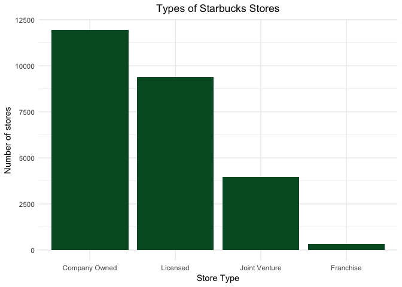
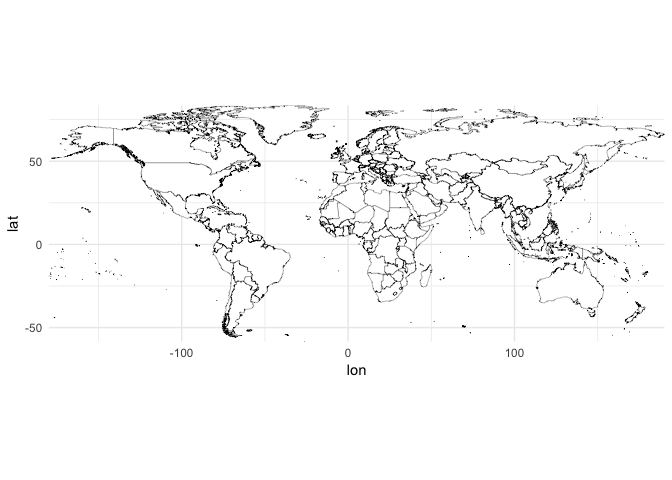
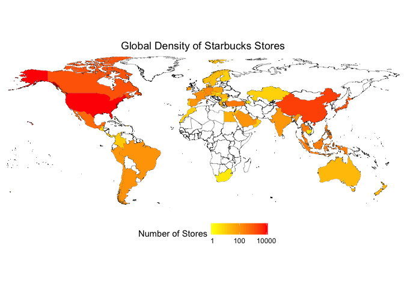
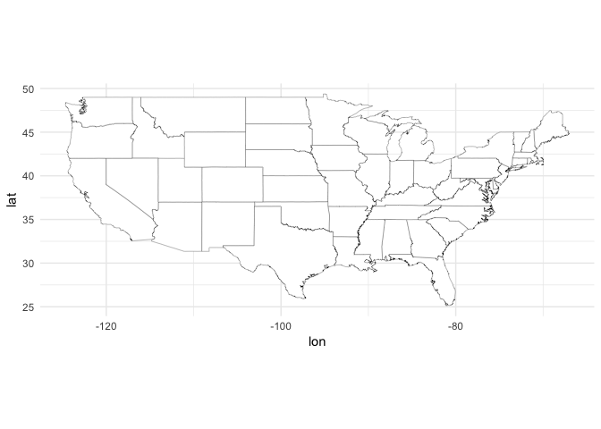
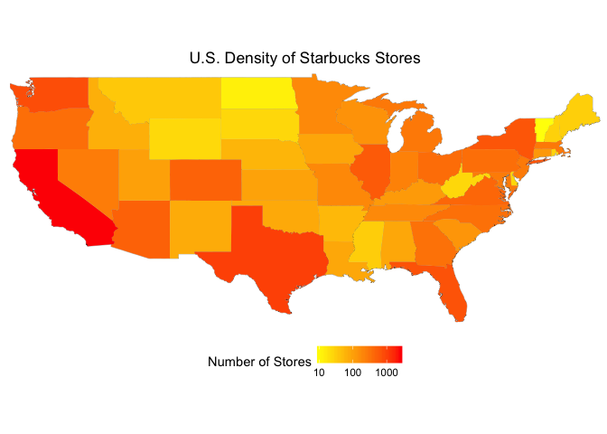
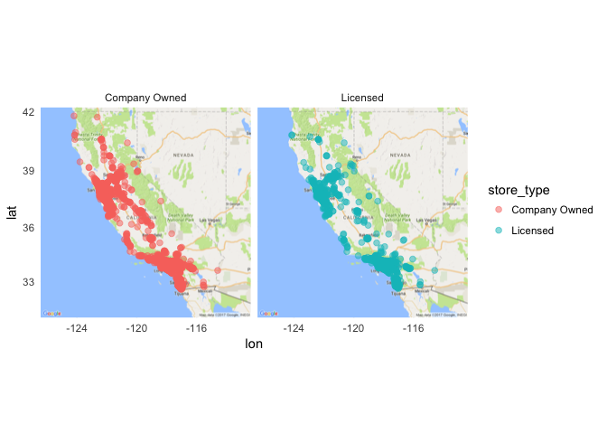
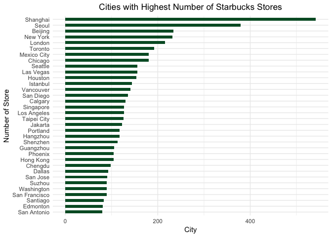

Explore
=======

There are some interesting questions to explore in this dataset related to ownership type and density of store locations on multiple geopolitical levels. For example, how many of each store type are there? What is the largest market outside of the U.S.? What is the largest market in the U.S.?

Business Model
--------------

We will start begin by visualizing the number of Starbucks store types:

``` r
sbux_stores %>%
  mutate(store_type = store_type %>% fct_infreq()) %>%
ggplot(sbux_stores, mapping = aes(store_type)) +
  geom_bar(fill = "#00592D") +
  labs(title = "Types of Starbucks Stores", x = "Store Type", y = "Number of stores") +
  theme_minimal() +
  theme(plot.title = element_text(hjust = 0.5))
```



Starbucks generates revenue mainly through its company-owned stores and licensed stores with a small percentage of revenue from consumer packaged goods and foodservice. According to the Starbucks 2016 Form 10K, stores accounted for roughly ~89% of total net revenue. Starbucks has two types of stores:

**Comapny-operated stores** are designed to create a unique Starbucks Experience built on superior customer service, well-maintained stores that are integrated into the community and providing a variety of high-quality beverages and foodstuffs. These stores are typically located in desirable locations (high-visibility and high-traffic) and typically generate more revenue than their licensed store counterparts.

**Licensed stores** are operated by external companies who have entered into an arrangement with Starbucks to use their brand. Under this type of model, Starbucks receives a share of the total store revenue in exchange for access to otherwise difficult retail spaces. For example, placing a licensed store inside Barnes & Noble allows Starbucks to target readers who may enjoy a coffee with their book. Starbucks sells its products and equipment to the licensee for use while requiring employees in these stores to undergo the same training given to those in company-owned stores.

However, when we run the `unique()` function on the `Ownership Type` column, there are two additional types of stores:

``` r
unique(sbux_stores["store_type"])
```

    ## # A tibble: 4 x 1
    ##      store_type
    ##           <chr>
    ## 1      Licensed
    ## 2 Joint Venture
    ## 3 Company Owned
    ## 4     Franchise

There are **joint venture** and **franchise stores**. These two models are used in Starbucks foreign market entry strategy. Similar to a licensed store, joint venture and franchise stores are permitted to use the Starbucks brand in return for a share of total revenue. It is easy to wrongly assume that Starbucks is a franchise due to their rapid growth in the U.S. However, Starbucks has only permitted a few franchise stores in the European market and is currently no longer recruiting franchisees. With regards to joint venture stores, Starbucks recently made news by acquiring the remaining 50% stake in its East China joint venture, allowing the company to assume full ownership. This reflects Starbucks desire to maintain a greater degree of control over its operations and businesses in order to reinforce company culture, prevent potential legal disputes and avoid conflicting pressures from its partners.

Spatial Analysis
----------------

In this next section, we will visualize the density of Starbucks stores on multiple geopolitical levels.

### Global Scale

First, let's create a base map of the world onto which we will eventually plot our data. In order to do this, we will:

-   get longitude/latitude data for the world using the `map_data()` function
-   rename `long` to `lon` for clarity
-   remove `Antarctica` since we know there aren't any Starbucks there:

``` r
world <- map_data("world") %>%
  filter(region != "Antarctica") %>%
  plyr::rename(c("long" = "lon"))

world_base <- ggplot(world) + 
  geom_polygon(aes(lon, lat, group = group), fill = "white", color = "black", size = 0.1) + 
  coord_equal() + 
  scale_x_continuous(expand = c(0,0)) + 
  scale_y_continuous(expand = c(0,0)) +
  theme_minimal()
world_base
```



This next part is a bit tricky. As we mentioned earlier, each region in our dataset is given in ISO 3166-1 alpha-2 codes, which are two-letter country codes. To plot our count of stores in each country, we need to get these codes in their names so we can join it with our `world` dataset to get the `group` information. The `group` argument controls whether adjacent points should be connected by lines. Regions in the same `group` will be connected and regions in a different `group` will not be connected. Essentially, it informs `ggplot` which regions should be connected together. Here's how we will approach this:

Step 1:

-   summarise the total number of stores in each region
-   `right_join` this data to `sbux_stores`
-   select the variables (`region`, `count`) that we are interested in

``` r
world_stores <- sbux_stores %>% 
  group_by(region) %>% 
  summarise(count = n())
world_stores <- right_join(world_stores, sbux_stores) %>%
  select(region, count)
```

Step 2:

-   download the codes and country name from the [Data Packaged Core Datasets](https://github.com/datasets/country-codes) on Github
-   rename `Code` column to `region` so we can perform a `right_join`
-   perform a `right_join()` and remove fields with NA
-   remove the column with the two-letter country codes since we don't need it anymore
-   rename **United States** to **USA** so it doesn't get left out in the `inner_join`

``` r
country_codes <- read_csv("country_codes.txt")
country_codes <- plyr::rename(country_codes, c("Code" = "region"))
world_stores <- right_join(country_codes, world_stores)
world_stores <- world_stores[, -2]
world_stores <- plyr::rename(world_stores, c("Name" = "region"))
world_stores[["region"]] <- str_replace(world_stores[["region"]], "United States", "USA")
```

Step 3:

-   `inner_join` our store location numbers to the `world` dataset
-   remove fields with NA

``` r
world_stores <- unique(world_stores)
world_stores <- inner_join(world, world_stores)
```

Step 4:

-   finally, we can plot!
-   since some countries have such a high density, it makes it difficult to discern differences among areas. A neat trick we can apply is to take the log10 transformation of the gradient using the `trans` argument
-   remember we are going to overlay our data on our world map and remove our axes and ticks:

``` r
no_axes <- theme(
  axis.text = element_blank(),
  axis.line = element_blank(),
  axis.ticks = element_blank(),
  panel.border = element_blank(),
  panel.grid = element_blank(),
  axis.title = element_blank())

world_base +  
  geom_polygon(data = world_stores, aes(lon, lat, group = group, fill = count)) +
  scale_fill_gradient(low = "yellow", high = "red", name = "Number of Stores", trans = "log10") +
  labs(title = "Global Density of Starbucks Stores") +
  coord_equal() +
  scale_x_continuous(expand = c(0, 0)) +
  scale_y_continuous(expand = c(0, 0)) +
  theme(plot.title = element_text(hjust = 0.5)) +
  theme(legend.position = "bottom", legend.key.size = unit(0.5, "cm")) +
  no_axes
```



The U.S. and China are Starbucks two largest markets. Let's explore each of these in turn:

**Americas**

In fiscal 2016, the Americas contributed to approximately 69% of consolidated total net revenue. However, lately there have been mounting concerns that the Americas market is becoming saturated. In a report from BMO Capital Markets, analyst Andrew Strelzik notes that increasing Starbucks store overlap is driving weaker sales in existing stores and calls for slowing U.S. development pace. Saturation implies slower growth rates which may lead some stores sales to stagnate or even decrease. As such, Starbucks should consider strategically closing some of its stores, especially if there are multiple Starbucks locations nearby. This will allow Starbucks to reduce operating expenses and divert those funds towards other developments such as the Reserve brand. Another option would be to replace an area with multiple existing Starbucks stores with one Starbucks Reserve store. With saturation of the specialty coffee market, focus should be directed towards retaining customers to float moderate growth, instead of further expanding store locations. This also points to the increased dependence on the Americas market, which remains the key driver of overall performance. Should the Americas revenue slow down or decline, this will negatively impact Starbucks financial results and ability to fund overseas developments or the Reserve brand. Whether Starbucks is able to sustain growth in the Americas depends on their finesse in maneuvering in an increasingly tight market and delivering new products to customers. Thus, the success of the Starbucks Reserve and Tasting Room development will be critical in competiting with other brands and maintaining growth.

**China/Asia**

Given the near-saturation of the American market, the Asian market becomes hugely significant in Starbucks long-term growth. The China/Asia total net revenue in fiscal 2016 increased by 23%, which is roughly double the increase in revenue in the Americas over the same period. As we mentioned earlier, Starbucks acquired the remaining stake in its East Asian joint venture, handing over more company-owned stores to Starbucks which tend to have higher gross sales than licensed stores. China's emerging middle class, favorable ongoing economic reforms and increased appetite for Western products, primes Starbucks for major growth in China. This has become an important area of interest for CEO Kevin Johnson, who plans on increasing the number of stores in China to 5,000 in over 200 cities. While China/Asia presents tremendous potential in becoming the largest market, there are many inherent and unique risks as well. These include:

-   Starbucks as a Western brand is undermining Chinese culture
-   government interventions favoring local competitors
-   introducing coffee to a primarily tea-drinking region

As it currently stands though, it appears that the odds of Starbucks replicating its rapid growth in China is fairly high after the recent buyout of its Asian joint venture partner, adding 1,300 more company-owned stores to the region.

It is also worthwhile to note that India represents another potential key growth market, especially with a booming population set to overtake even China. However, growth in the area appears relatively modest, which may suggest heightened barriers to entry in the region and other unique cultural challenges.

### Regional Scale

In this section, we will visualize the density of Starbucks stores the U.S. market in greater detail.

Earlier, we mentioned that concern is rising over saturation of the U.S. market. Let's take a closer look at store density in the U.S. We will start with a base map of the U.S. with state boundaries:

``` r
states <- map_data("state")
states <- plyr::rename(states, c("long" = "lon"))

us_base <- ggplot(states) + 
  geom_polygon(aes(x = lon, y = lat, group = group), fill = "white", color = "black", size = 0.1) + 
  coord_equal() +
  theme_minimal()
us_base
```



We will take a similar approach with our U.S. map as we did with our global map.

Step 1:

-   filter `region` by US, group by state and summarise the number of stores in each state

``` r
us_stores <- sbux_stores %>% 
  filter(region == "US") %>%
  group_by(state) %>%
  summarise(count = n())
```

Step 2:

-   download state codes from [Github](https://github.com/jasonong/List-of-US-States) by user [jasonong](https://github.com/jasonong)
-   rename state to abbreviation so we can do a `inner_join`
-   remove the column with the state codes
-   rename states to region so we can do an `inner_join`
-   change state names to lowercase and convert to a `tibble`
-   convert the `tibble` to class `numeric`:

``` r
state_codes <- read_csv("states.csv")
us_stores <- plyr::rename(us_stores, c("state" = "Abbreviation"))
us_stores <- inner_join(state_codes, us_stores)
us_stores <- us_stores[, -2]
us_stores <- plyr::rename(us_stores, c("State" = "region"))
us_stores <- sapply(us_stores, tolower)
us_stores <- as.tibble(us_stores)
us_stores <- inner_join(states, us_stores)
us_stores[["count"]] <- as.numeric(us_stores[["count"]])
```

Step 3:

-   plot!

``` r
us_base +  
  geom_polygon(data = us_stores, aes(lon, lat, group = group, fill = count)) +
  scale_fill_gradient(low = "yellow", high = "red", name = "Number of Stores", trans = "log10") +
  labs(title = "U.S. Density of Starbucks Stores") +
  coord_equal() +
  scale_x_continuous(expand = c(0, 0)) +
  scale_y_continuous(expand = c(0, 0)) +
  theme(plot.title = element_text(hjust = 0.5)) +
  theme(legend.position = "bottom", legend.key.size = unit(0.5, "cm")) +
  no_axes
```



The density of Starbucks stores is the highest on the West Coast, led by California, Washington and Oregon. In general, there appear to be more stores along the coast compared to the U.S. interior and is part of a growing trend of coastal elite states that generate much of U.S. economic activity and wealth. These regions create a high demand for innovation for which the rewards are high. In turn, this attracts more innovative workers and companies to the area who want to work with like-minded peers. As a result, talent and high-paying jobs tend to be concentrated in these areas. By opening more stores along the coast, Starbucks is strategically poised to capture the wealth created in these states. States in the interior U.S. however may pose an opportunity for potential future growth although there are a number of associated risks and issues which include:

-   some states will naturally have lower populations (Alaska, Wyoming, Vermont, etc.) which limits the number of consumers and demand for Starbucks
-   economic conditions in some states may not be favorable for Starbucks growth because customers have less money for unnecessary purchases and trade down to lower priced products
-   customers are accustomed to their local coffee store and may resist purchasing from Starbucks

As you can see, the U.S. market is already fairly tight and future success depends on cultivating and retaining customers rather than growth.

### California

We will peel back another layer and explore our largest U.S. market, California, which has roughly 2,800 stores. To avoid overplotting our points, we will use the handy `facet_wrap()` function to separate the stores by type:

``` r
ca_stores <- sbux_stores %>%
  filter(state == "CA")

ca <- get_map("california", zoom = 6, maptype = "roadmap")
ggmap(ca) +
  geom_point(data = ca_stores, aes(lon, lat, color = store_type), size = 2, alpha = 0.5, position = "jitter") +
  facet_wrap(~ store_type) +
  theme_minimal()
```



The distribution of Starbucks stores is approximately the same for both company-owned and licensed stores. They are heavily concentrated in metropolitan areas such as the Bay Area, Los Angeles and San Diego. Starbucks has a significantly smaller footprint in the upper-north and central regions, presumably due to a lower population in these areas. It is also interesting to note that in some areas, we can overlay Starbucks stores over a major interstate. For example, we see multiple Starbucks stores along Highway 99 which connects Sacramento and Bakersfield. Likewise, there are a chain of Starbucks stores along Highway 101, which links the Bay Area and Los Angeles. This speaks to the grab-and-go style of coffee that Starbucks is attempting to buck today. What better way to capitalize on long-distance drivers and travelers than strategically placing coffee stores along the highway where they can get some caffeine to keep them up for the drive?

Reserve Roastery Locations
--------------------------

The Reserve Roastery and Tasting Rooms are the centerpieces of Starbucks strategy for tuning the brand to reflect coffee consumer tastes today. They are meant to showcase everything from rare batches of small-lot, single origin coffees to unique alternative brewing methods. The Reserve Roasteries goal is to pivot away from the impression of Starbucks as a large commercial company and towards a more craft-oriented coffee maker. Customers sit down and slowly enjoy a coffee instead of quickly ordering at a store and leaving. Starbucks wants more people to slow down to enjoy the experience and the Tasting Rooms are designed with this goal in mind. Considering the importance of the Roasteries and Tasting Rooms, it begs the question of where these Roasteries are going to be constructed. Executive Chairman Schultz has said he plans to build 20 - 30 Roasteries in major global cities, but hasn't specified where.

It would make sense to open a Roastery in cities with a high number of stores to expose a greater number of consumers to Starbucks new brand. In this section, we will look at which cities have the most stores:

``` r
city <- sbux_stores %>% 
  group_by(city) %>%
  summarise(count = n()) %>%
  filter(count >= 80)
```

``` r
ggplot(city, aes(reorder(City, Count), Count)) +
  geom_bar(stat = "identity", fill = "#00592D", width = 0.5) +
  coord_flip() +
  labs(title = "Cities with Highest Number of Starbucks Stores", x = "Number of Store", y = "City") +
  theme_minimal() +
  theme(plot.title = element_text(hjust = 0.5))
```



In Shanghai alone, there are a staggering 542 stores which is 163 more stores than Seoul, the second most numerous stores per city. This attests to the importance of the China/Asia market in Starbucks long term growth strategy. The Americas are also well represented in our graph, demonstrating the maturity of the Americas market.

Currently, the Seattle Roastery is the only one open, but there are two other Roasteries set to open domestically in New York in 2018 and Chicago in 2019. Internationally, a Roastery is on track to open in Shanghai in late 2017 with two more Roasteries opening in Milan and Tokyo in 2018. All of the domestic Roastery locations rank among the cities with the most Starbucks stores. However, this isn't necessarily true when we venture out of the Americas. Milan and Tokyo aren't even on our list, with Shanghai being the only exception. Milan holds special significance for Starbucks and former CEO Schultz, who was more or less inspired by the strong Italian coffee culture and attempted to recreate that experience in the U.S. Likewise, Tokyo is special because it was the first Starbucks location opened outside of North America. Japan also has a strong coffee culture, reminiscent of kissaten's, a traditional Japanese-style tea room that serves coffee as well. Japanese coffee equipment makers, Hario and Kalita, are practically synonymous with third wave coffee today as a result of small kissaten owners experimentation and dedication to craftsmanship.

Trying to predict the next Reserve Roastery location isn't simply based on the size of the market, although market size is certainly an important variable. For example, it is important for Starbucks to open a Roastery in Shanghai, their largest market, to support further expansion and growth in the China/Asia market. The Milan and Tokyo Roastery however, demonstrate that Starbucks is also investing in regions where the community is passionate about coffee culture. This shows that Starbucks is really trying to shed its image as a stop-and-go coffee store, which is important for capturing the coffee consumers of today who are more experiential and less materialistic.
